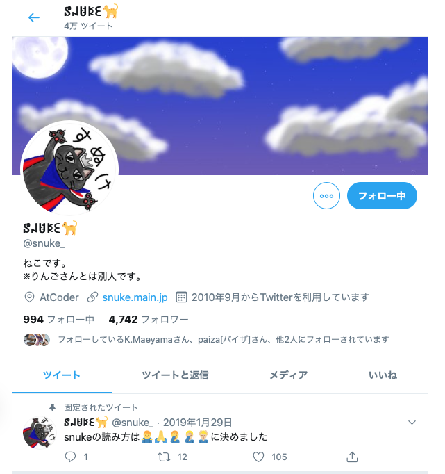

## 似ている文字サーチャー

### 概要

遊びで作っちゃった Web アプリ。  
Twitter とかで変わった形の文字を使っている人を見て、形の似た文字を自動的に調べてくれるアプリがあったらおもしろいかと思い、作ってしまった。

<caption>変わった形の文字を使っている人の例</caption>

### 公開場所
[https://niterumoji-searcher.herokuapp.com](https://niterumoji-searcher.herokuapp.com) で公開中

### 技術的な話

1. ツールを用いて文字を白黒画像化
2. 画像をオートエンコーダに突っ込んで次元削減
3. 得られたベクトルを用いて，コサイン類似度で比較
	- 単純に全データでやると時間がかかりすぎるので，事前に kmeans を使ってクラスタリングし，同クラスターのみを検索対象とするように工夫